# Pratikum 7 - PHP Dasar
### NAMA : Raihan Ardiansyah
### NIM : 312410396
### KELAS : TI.24.A3

## 📍LANGKAH - LANGKAH PENGERJAAN

### 1. Persiapan 

Untuk memulai membuat kode php, perlu disiapkan web server dan interpreter PHP
terlebih dahulu. Web servar yang kita gunakan adalah Apache 2 dan interpreter PHP 7.
Untuk memudahkan proses praktikum, kita gunakan aplikasi bundle web server yaitu
XAMPP.

**Install XAMPP**

Unduh XAMPP dari https://www.apachefriends.org/download.html dan pilih versi
portable untuk memudahkan proses installasi. Kemudian extract file tersebut, seusikan
direktorinya (misal: d:\xampp).

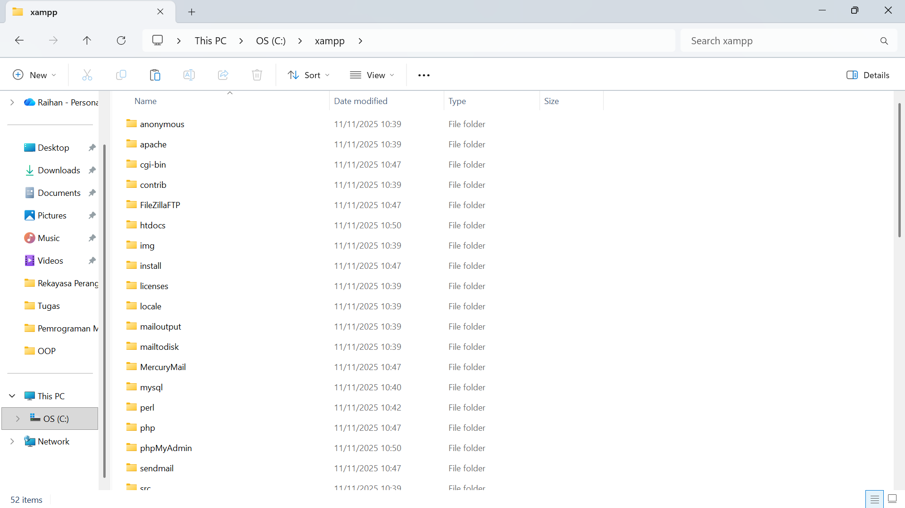

Konfigurasi Web Server

• Konfigurasi Apache

Untuk konfigurasi HTTP server, seperti port yang digunakan akses HTTP, modul
yang diaktifkan, lokasi document root, dll.

Lokasi file: \xampp\apache\conf\httpd.conf

• Konfigrasi PHP

Untuk konfigurasi perilaku engine PHP yang berefek pada keamanan dan performa.
Seperti batas maksimal waktu eksekusi script, batas file yang dapat diupload, error
reporting, dll.

Lokasi file: \xampp\php\php.ini

• Konfigrasi MySql

Konfigurasi server MySQL, seperti administrator user, port, timezone, dll.

Lokasi file: \xampp\mysql\bin\my.ini

**Menjalankan Web Server**

Untuk menjalankan web server dari menu XAMPP Control.

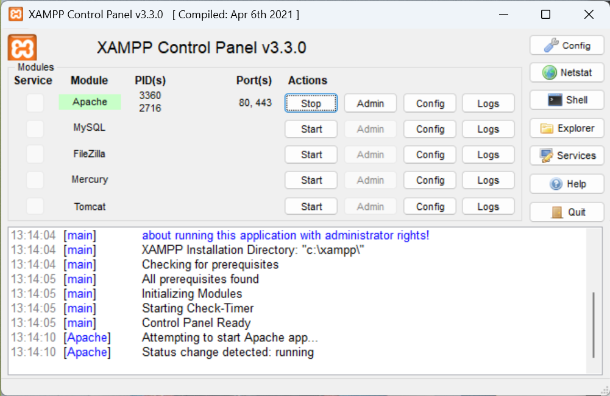

• Uji coba apakah server sudah berkerja dengan baik

http://127.0.0.1 atau http://localhost

Tampil halaman utama XAMPP jika server sudah berkerja dengan baik.

• Dokumen Website

Semua file website tempatkan di direktori: \xampp\htdocs\

• Database MySQL

Direktori: \xampp\mysql\

Manajemen database: http://localhost/phpmyadmin

**Memulai PHP**

Buat folder lab7_php_dasar pada root directory web server (d:\xampp\htdocs)

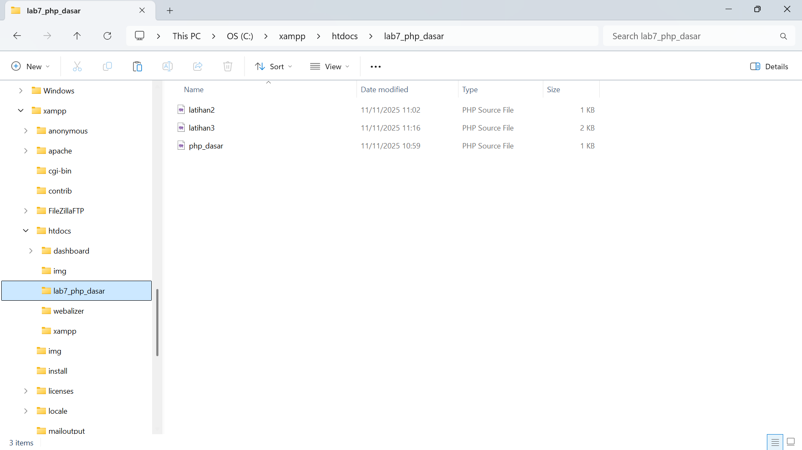

Kemudian untuk mengakses direktory tersebut pada web server dengan mengakses URL:

http://localhost/lab7_php_dasar/

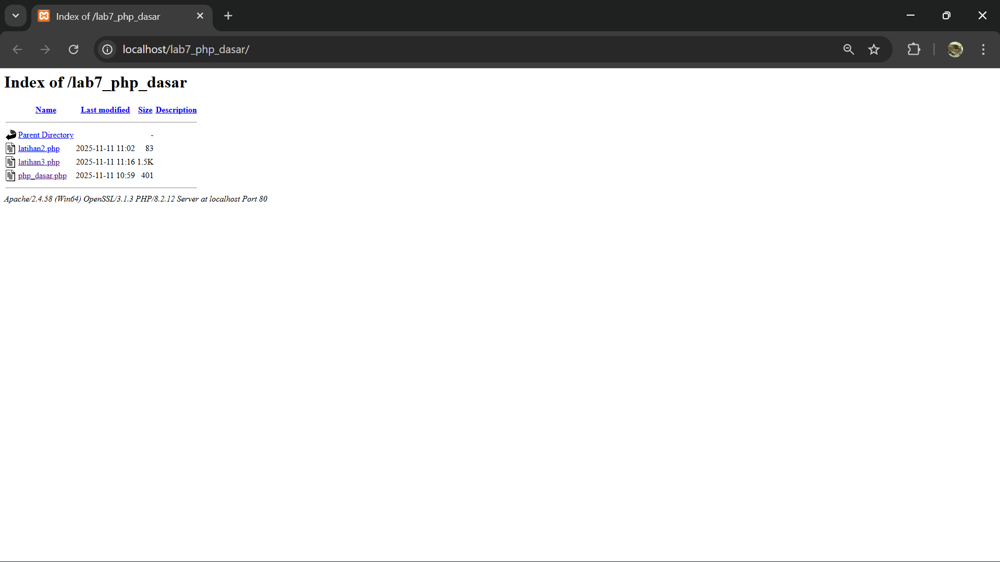

**PHP Dasar**

Buat file baru dengan nama php_dasar.php pada directory tersebut. Kemudian buat
kode seperti berikut.

Kemudian untuk mengakses hasilnya melalui URL:

http://localhost/lab7_php_dasar/php_dasar.php

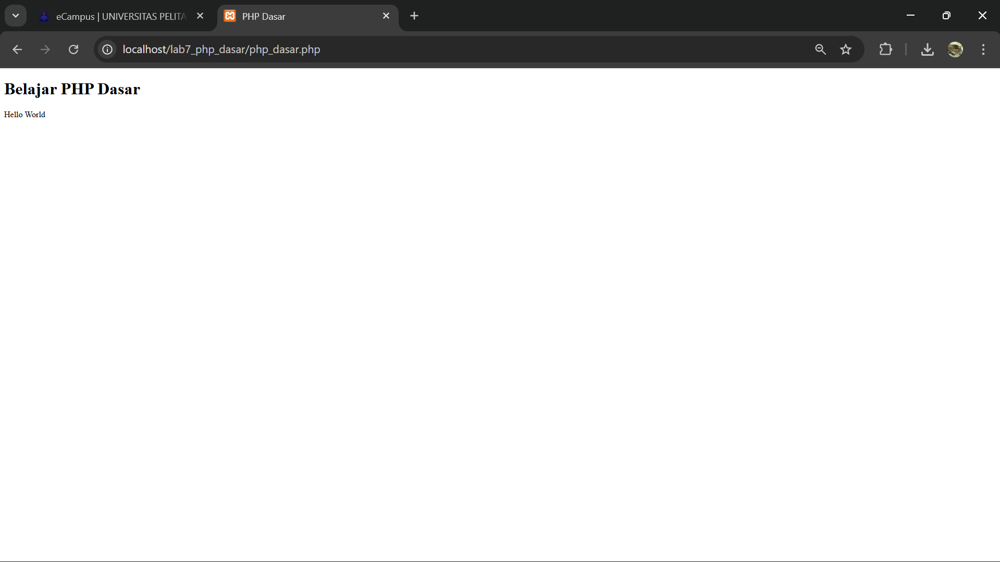

**Variable PHP**

Menambahkan variable pada program.

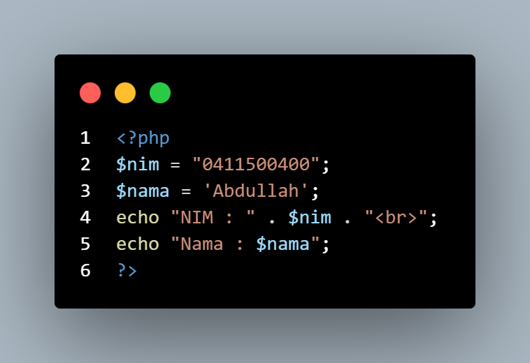

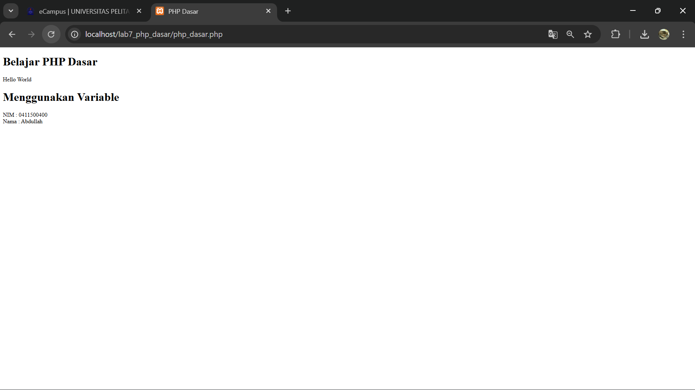

**Predefine Variable $_GET**

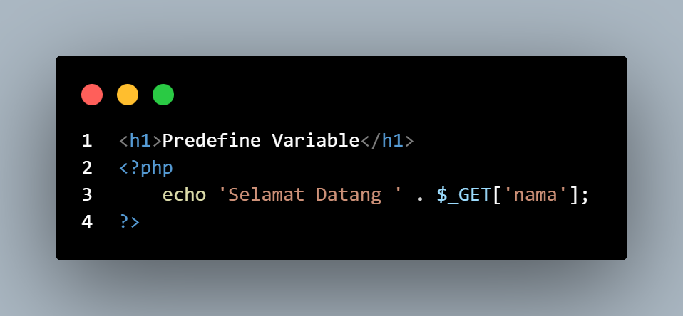

Untuk mengaksesnya gunakan URL:

http://localhost/lab7_php_dasar/latihan2.php?nama=Agung

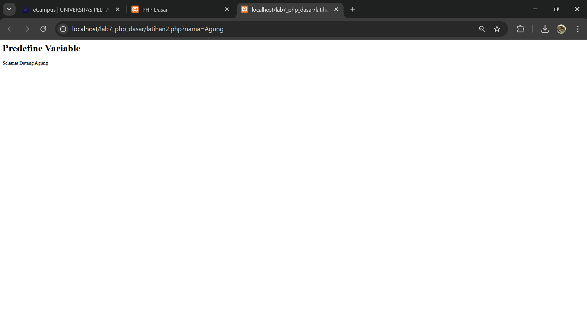

Membuat Form Input

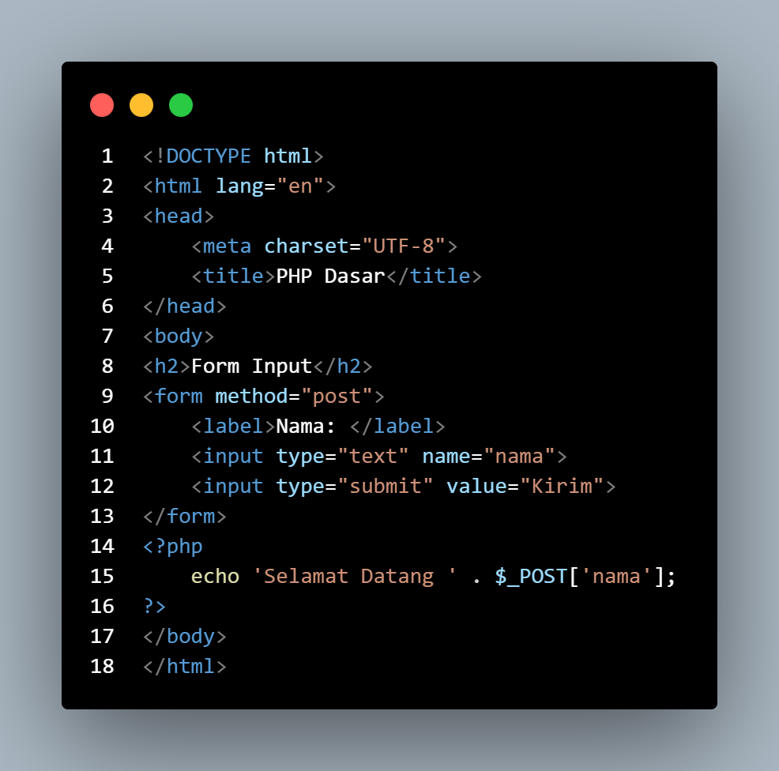

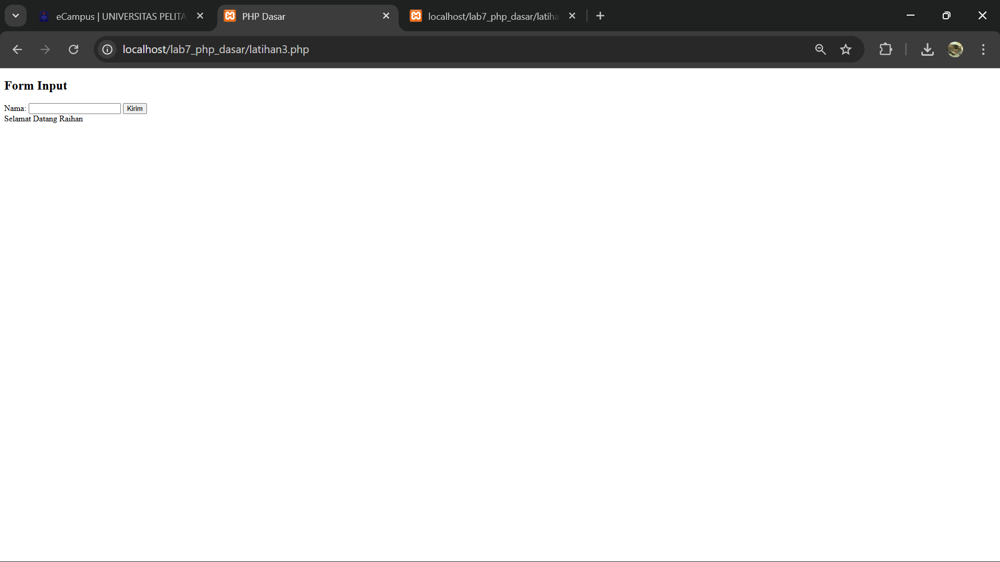

**Operator**

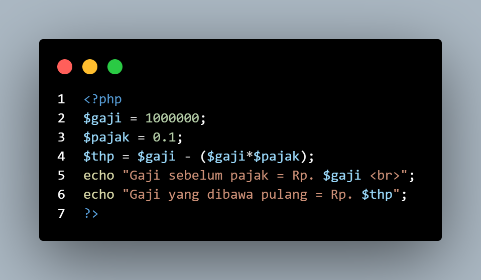

**Kondisi IF**

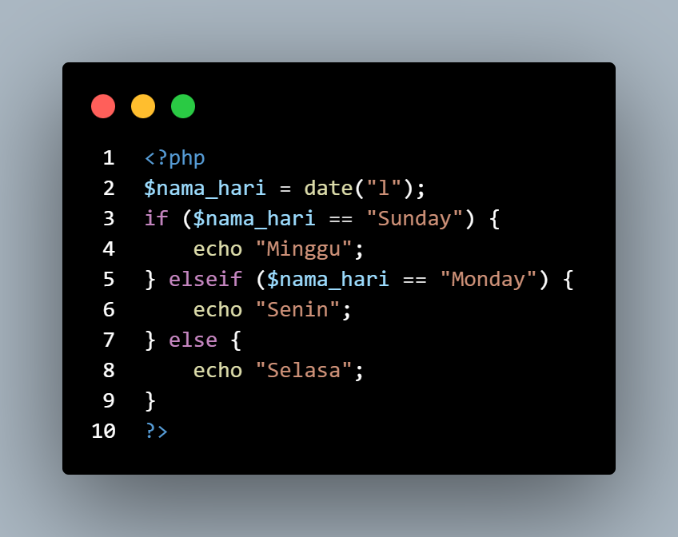

**Kondisi Switch**

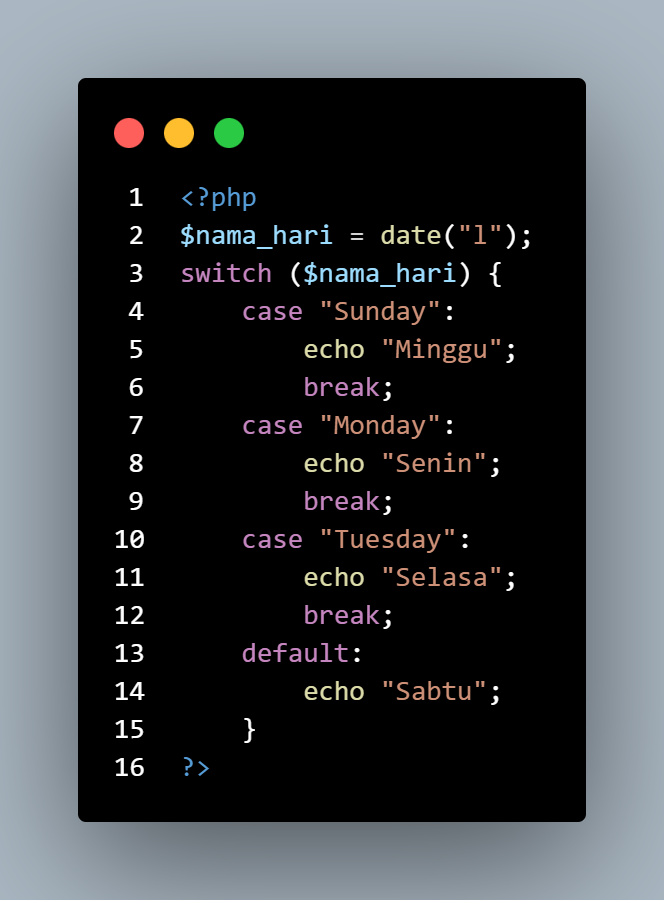

**Perulangan for**

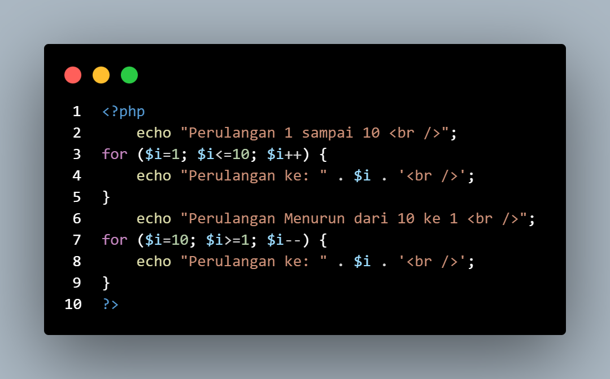

**Perulangan while**

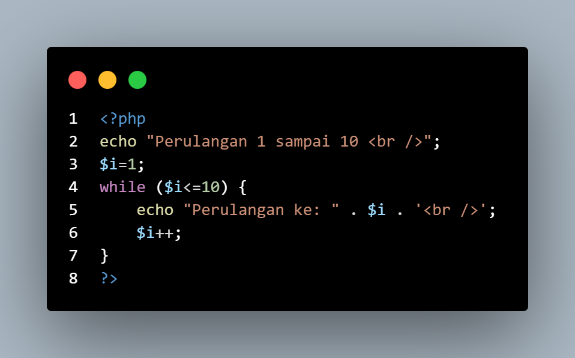

**Perulangan dowhile**

**Pertanyaan dan Tugas**

Buatlah program PHP sederhana dengan menggunakan form input yang menampilkan
nama, tanggal lahir dan pekerjaan. Kemudian tampilkan outputnya dengan menghitung
umur berdasarkan inputan tanggal lahir. Dan pilihan pekerjaan dengan gaji yang
berbeda-beda sesuai pilihan pekerjaan.

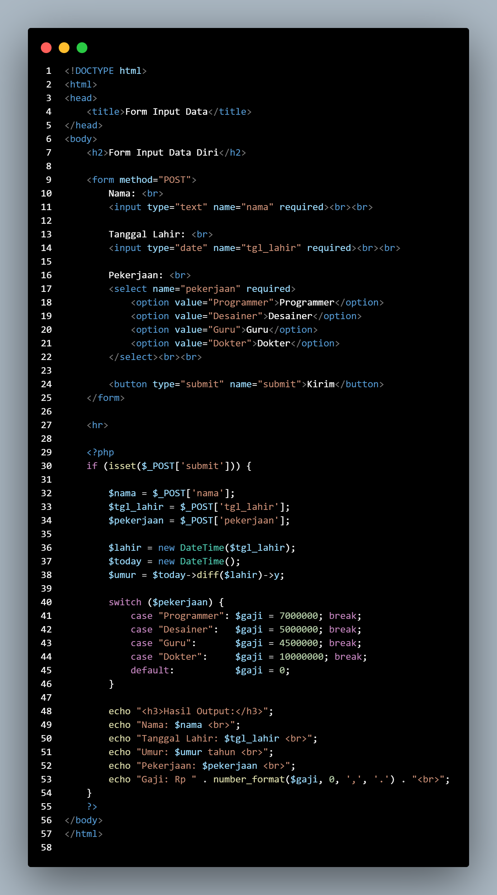

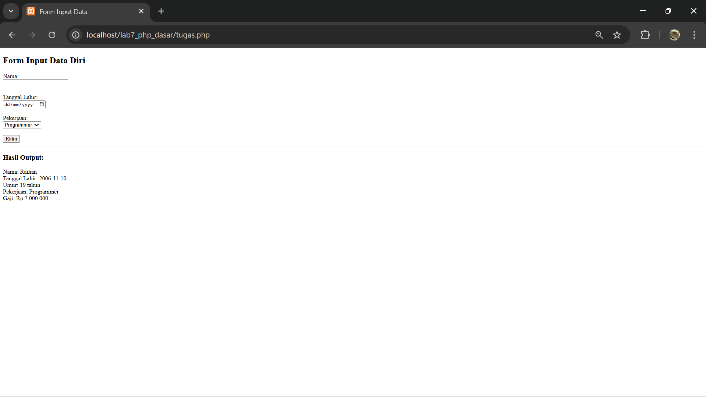
